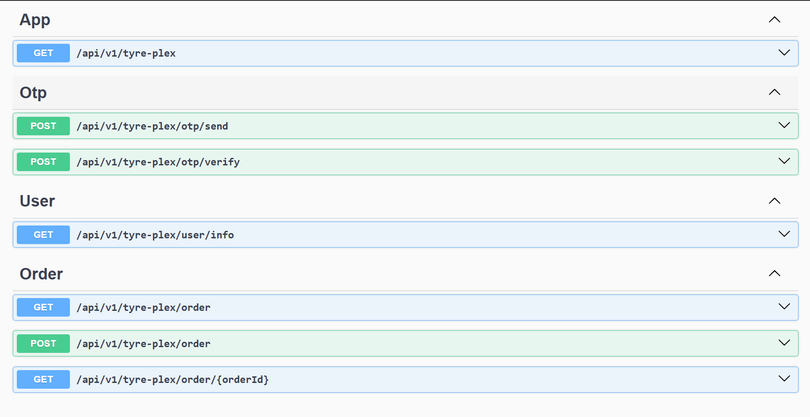

# 🛒 Order Service

A full-stack application to manage orders, powered by Kafka, MySQL, Redis, NestJS (backend), and Next.js (frontend). It supports real-time event handling with Kafka, caching with Redis, secure authentication with JWT, and a modern UI for order management.

---

## 📝 Summary

This project is composed of two main components:

- **Backend (NestJS)**  
  Handles order-related logic, integrates with Kafka for event streaming, Redis for caching, and MySQL for persistent storage. Includes Swagger documentation for easy API exploration.

- **Frontend (Next.js)**  
  A simple and responsive UI that interacts with the backend for order management tasks. Environment configurable and ready for local development.

Docker is used for running Kafka, MySQL, and Redis locally. The services can also be configured to work with cloud-hosted infrastructure.

---

## 🧰 Prerequisites

Ensure the following services are available either locally via Docker or through your preferred cloud provider:

- Kafka
- MySQL
- Redis

> **Note**: You can skip Docker if you're using managed cloud services.

To start local services via Docker:

```bash
docker compose start
```

---

## 🚀 Backend Setup (NestJS)

### 1. Environment Configuration

Create a `.env` file inside the `backend-nestjs/` directory with the following values:

```env
# Redis Config
REDIS_CACHE_HOST=localhost
REDIS_CACHE_PORT=6379
REDIS_CACHE_USERNAME=default
REDIS_CACHE_PASSWORD=password

# JWT
JWT_SECRET="this is secret"

# MySQL Config
SQL_DB=mydatabase
SQL_HOST=localhost
SQL_USERNAME=myuser
SQL_PASSWORD=mypassword
SQL_PORT=3306

# Kafka Config
KAFKAJS_NO_PARTITIONER_WARNING=1
KAFKA_BROKERS="172.22.119.188:9092"
KAFKA_ORDER_TOPIC="order_events"
```

### 2. Install Dependencies

```bash
cd backend-nestjs
npm install
```

### 3. Start the Server

```bash
npm run start
```

### 🔍 API Docs (Swagger)

Access the backend API documentation at:

[http://localhost:3000/api/v1/tyre-plex/docs](http://localhost:3000/api/v1/tyre-plex/docs)



---

## 💻 Frontend Setup (Next.js)

### 1. Environment Configuration

Create a `.env` file inside the `frontend-nextjs/` directory:

```env
API_URL=http://localhost:3000
```

### 2. Install Dependencies

```bash
cd frontend-nextjs
npm install
```

### 3. Start the Development Server

```bash
npm run dev
```

Access the frontend at:

[http://localhost:3001/login](http://localhost:3001/login)
